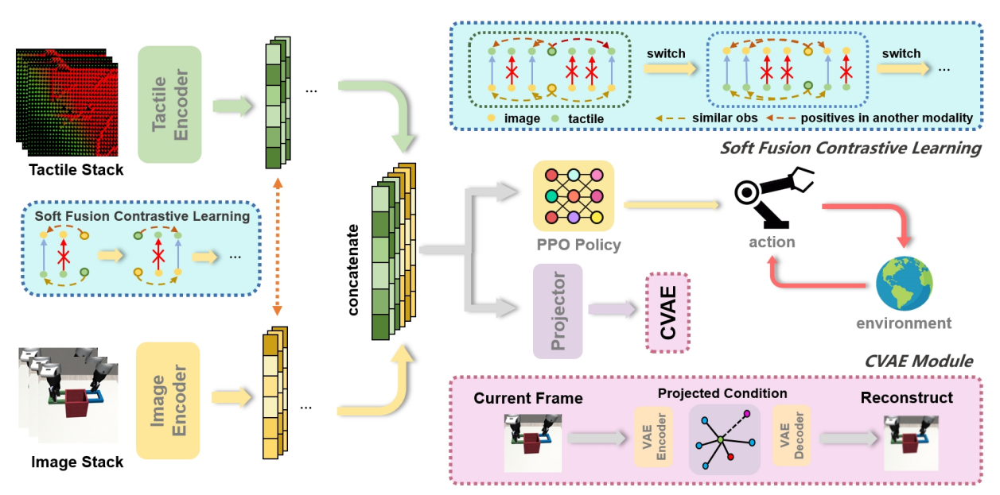

<!-- # New Version Command
MUJOCO_EGL_DEVICE_ID=6 CUDA_VISIBLE_DEVICES=6 MUJOCO_GL='egl' python train.py --note "XXXXXXX to confirm your note for this experiment" --env "HandManipulatePenRotateFixed-v1"

MUJOCO_EGL_DEVICE_ID=6 CUDA_VISIBLE_DEVICES=6 MUJOCO_GL='egl' python eval.py -->

# ViTaS: Visual Tactile Soft Fusion Contrastive Learning for Visuomotor Learning

[Paper](https://skyrainwind.github.io/papers/icra_vitas.pdf) [Website](https://skyrainwind.github.io/ViTaS/index.html)

[Yufeng Tian*](https://skyrainwind.github.io), [Shuiqi Cheng*](https://github.com/shuiqicheng), [Tianming Wei](https://www.stillwtm.site/), [Tianxing Zhou](https://github.com/ZTX2021), [Yuanhang Zhang](https://yuanhangz.com/), [Zixian Liu](https://storeblank.github.io/), [Qianwei Han](https://der-mark.github.io/), [Zhecheng Yuan](gemcollector.github.io), [Huazhe Xu](hxu.rocks).

\* Equal contribution.

We propose **Vi**sual **Ta**ctile **S**oft Fusion Contrastive Learning (ViTaS), a novel visuo-tactile representation learning framework for visuomotor learning. 



## Installation
```
conda env create -f environment.yml
cd third_party && pip install -r requirements.txt && cd ..
```

## Training ViTaS
```
bash train.sh
```
For more tasks and algorithms, please refer to [train.sh](train.sh) for more details.

# Acknowledgement
Our code is generally built upon [M3L](https://github.com/carlosferrazza/M3L) and [tactile_envs](https://github.com/carlosferrazza/tactile_envs). Tactile sensors used in real-world experiments are built with the help of [3D-ViTaC](https://binghao-huang.github.io/3D-ViTac/). We thank all these authors for their nicely open sourced code and their great contributions to the community.